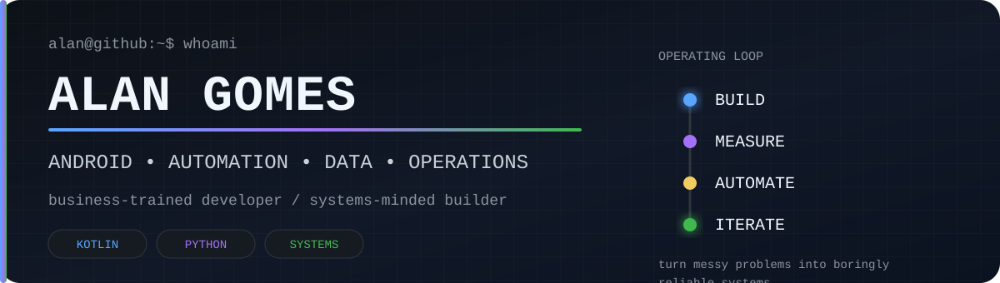

<p align="center">
  
</p>

<p align="center">
  <a href="https://www.linkedin.com/in/alan-android/">
    
  </a>
  <a href="https://www.linkedin.com/in/alan-gomes-b197771b5/">
    
  </a>
  <a href="mailto:alan.lucindo.gomes@alumni.usp.br">
    
  </a>
</p>

<h3 align="center">I turn ambiguous problems into software, workflows, and measurable systems.</h3>

<p align="center">
  Android developer • automation-minded builder • business-trained problem solver • São Paulo, Brazil
</p>

---

## The part that doesn't fit in a tech-stack badge

Most developers introduce themselves with a list of technologies. I prefer starting **one layer earlier**.

I like understanding how a system works, where it leaks time, which data actually matters, what should remain human, and what deserves to become software. My background mixes **Business Administration at FEA-USP**, **operations/logistics experience at RD Saúde**, and hands-on **Android/software development**.

That combination changed the way I build things: code is not the goal. **A better system is.**

```text
real-world problem
      │
      ├── people & process
      ├── data & constraints
      └── product / automation
                  │
                  ▼
       build → measure → automate → iterate
                  │
                  ▼
        something boringly reliable
```

## My unusual combination

<table>
  <tr>
    <td width="33%" valign="top">
      <h3>📱 Product Engineer</h3>
      Native Android with <b>Kotlin</b>, Jetpack Compose, classic Views, REST APIs, local persistence and modern app architecture.
      <br><br>
      I care about the whole path from UI state to data flow — not just making the screen compile.
    </td>
    <td width="33%" valign="top">
      <h3>⚙️ Automation Builder</h3>
      <b>Python, SQL, APIs, scripts, data analysis and workflow automation.</b>
      <br><br>
      Repetitive work makes me suspicious. If a process repeats enough times, I start looking for the script hiding inside it.
    </td>
    <td width="33%" valign="top">
      <h3>🧠 Business Operator</h3>
      Process thinking, metrics, operations, prioritization and decision-making shaped by a Business Administration background at <b>FEA-USP</b> and real operational experience.
      <br><br>
      I naturally ask: <i>what problem are we actually solving?</i>
    </td>
  </tr>
</table>

## Selected builds

<table>
  <tr>
    <td width="50%" valign="top" align="center">
      <a href="https://github.com/alanliongar/PokeDex">
        
      </a>
      <h3>⚡ <a href="https://github.com/alanliongar/PokeDex">PokéDex — AI Powered</a></h3>
      Pokémon exploration app powered by PokéAPI, with modern Compose UI, dynamic visual treatment and AI-generated text battles.
      <br><br>
      <code>Kotlin</code> <code>Compose</code> <code>Retrofit</code> <code>Hilt</code> <code>OpenAI API</code>
    </td>
    <td width="50%" valign="top" align="center">
      <a href="https://github.com/alanliongar/LearnEverythingBot">
        
      </a>
      <h3>🧠 <a href="https://github.com/alanliongar/LearnEverythingBot">Learn Everything Bot</a></h3>
      Turns a subject into a clickable study structure with AI summaries, persisted questions and quiz-based learning.
      <br><br>
      <code>Kotlin</code> <code>Compose</code> <code>StateFlow</code> <code>Hilt</code> <code>OpenAI API</code>
    </td>
  </tr>
  <tr>
    <td width="50%" valign="top" align="center">
      <a href="https://github.com/alanliongar/FinTrack">
        
      </a>
      <h3>💰 <a href="https://github.com/alanliongar/FinTrack">FinTrack</a></h3>
      Native finance tracker for income, expenses and balances, built around local persistence and practical day-to-day use.
      <br><br>
      <code>Kotlin</code> <code>Room</code> <code>RecyclerView</code> <code>Android Views</code>
    </td>
    <td width="50%" valign="top" align="center">
      <a href="https://github.com/alanliongar/CineNow">
        
      </a>
      <h3>🎬 <a href="https://github.com/alanliongar/CineNow">CineNow</a></h3>
      Movie discovery app backed by TMDB, with movie details, Compose UI and a structured MVVM / Repository architecture.
      <br><br>
      <code>Kotlin</code> <code>Compose</code> <code>MVVM</code> <code>Retrofit</code> <code>Hilt</code>
    </td>
  </tr>
</table>

<p align="center">
  <a href="https://github.com/alanliongar/TaskBeat">TaskBeat</a> •
  <a href="https://github.com/alanliongar/Weather">Weather</a> •
  <a href="https://github.com/alanliongar/RickAndMorty">Rick & Morty</a> •
  <a href="https://github.com/alanliongar/BitcoinPrice">Bitcoin Price</a> •
  <a href="https://github.com/alanliongar/ArtistList">ArtistList</a>
</p>

## Toolbox

<p>
  
  
  
  
  
  
  
  
</p>

**Android:** Kotlin · Jetpack Compose · XML / Views · MVVM · Clean Architecture · Repository Pattern · Retrofit · OkHttp · Room · Dagger/Hilt · Coroutines / Flow · REST / JSON · Unit Testing

**Beyond mobile:** Python · SQL · VBA · automation · data analysis · API integration · AI-assisted workflows · self-hosted systems

## Background

<table>
  <tr>
    <td align="center" width="150">
      <a href="https://www.fea.usp.br/en">
        
      </a>
    </td>
    <td valign="middle">
      <b>Bachelor's Degree in Business Administration — FEA-USP, University of São Paulo</b><br>
      A business foundation that still shows up in how I reason about products, processes, incentives, metrics and trade-offs.
    </td>
  </tr>
  <tr>
    <td align="center"><b>RD Saúde</b></td>
    <td valign="middle">
      <b>Operations / Logistics experience</b><br>
      Real-world exposure to processes, execution, data and operational constraints before software became my main craft.
    </td>
  </tr>
</table>

## The rules I build by

> **Useful > impressive.**  
> **Evidence > assumptions.**  
> **Automate repetition, not judgment.**  
> **Complexity has to pay rent.**  
> **Ship something observable, then learn from reality.**

---

<p align="center">
  <b>Two professional lenses. One brain.</b><br>
  <a href="https://www.linkedin.com/in/alan-android/">Technology / Android</a> ·
  <a href="https://www.linkedin.com/in/alan-gomes-b197771b5/">Business / Operations</a> ·
  <a href="mailto:alan.lucindo.gomes@alumni.usp.br">Email</a>
</p>

<p align="center"><sub>Side effect of working with me: spreadsheets have a tendency to become scripts, and scripts have a tendency to become systems.</sub></p>
